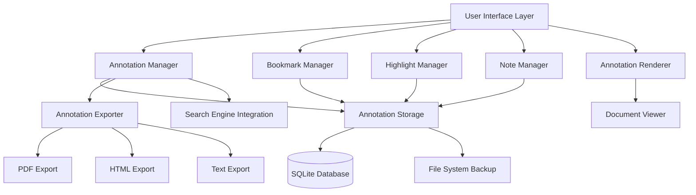
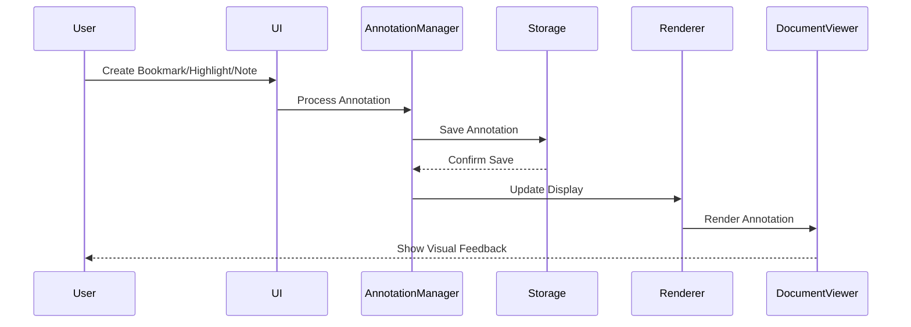

# Bookmarks and Annotations System Design

## Overview

The Bookmarks and Annotations system provides a comprehensive solution for interactive document reading, allowing users to mark, highlight, annotate, and organize their reading materials. The system is designed to be performant, scalable, and seamlessly integrated with the existing Modern EBook Reader architecture.

## Architecture

### High-Level Architecture



### Component Interaction Flow



## Components and Interfaces

### 1. Annotation Manager (Core Component)

**Purpose:** Central coordinator for all annotation operations

**Key Methods:**
```python
class AnnotationManager:
    def create_bookmark(self, document_path: str, page: int, title: str = None) -> Bookmark
    def create_highlight(self, document_path: str, page: int, selection: TextSelection, color: str) -> Highlight
    def create_note(self, document_path: str, page: int, position: Point, content: str) -> Note
    def get_annotations(self, document_path: str, annotation_type: str = None) -> List[Annotation]
    def search_annotations(self, query: str, filters: Dict) -> List[Annotation]
    def export_annotations(self, document_path: str, format: str) -> str
    def import_annotations(self, file_path: str) -> bool
```

**Integration Points:**
- Storage layer for persistence
- UI components for user interaction
- Search engine for annotation search
- Export system for sharing

### 2. Bookmark Manager

**Purpose:** Specialized handling of page bookmarks

**Key Features:**
- Visual bookmark indicators
- Custom bookmark titles and descriptions
- Bookmark organization and categorization
- Quick navigation to bookmarked pages

**Data Structure:**
```python
@dataclass
class Bookmark:
    id: str
    document_path: str
    page_number: int
    title: str
    description: str
    category: str
    created_at: datetime
    updated_at: datetime
    position: Optional[Point] = None  # For precise positioning
```

### 3. Highlight Manager

**Purpose:** Text highlighting with color coding and organization

**Key Features:**
- Multi-color highlighting system
- Overlapping highlight handling
- Highlight search and filtering
- Color-based categorization

**Data Structure:**
```python
@dataclass
class Highlight:
    id: str
    document_path: str
    page_number: int
    text_selection: TextSelection
    highlighted_text: str
    color: str
    category: str
    created_at: datetime
    updated_at: datetime
    
@dataclass
class TextSelection:
    start_position: Point
    end_position: Point
    start_char_index: int
    end_char_index: int
```

### 4. Note Manager

**Purpose:** Sticky notes and detailed comments system

**Key Features:**
- Rich text note editing
- Note positioning and anchoring
- Note search and organization
- Note threading and replies

**Data Structure:**
```python
@dataclass
class Note:
    id: str
    document_path: str
    page_number: int
    position: Point
    content: str  # Rich text HTML
    plain_text: str  # For searching
    category: str
    created_at: datetime
    updated_at: datetime
    parent_note_id: Optional[str] = None  # For threaded notes
```

### 5. Annotation Storage

**Purpose:** Persistent storage and retrieval of all annotations

**Database Schema:**
```sql
-- Main annotations table
CREATE TABLE annotations (
    id TEXT PRIMARY KEY,
    type TEXT NOT NULL,  -- 'bookmark', 'highlight', 'note'
    document_path TEXT NOT NULL,
    page_number INTEGER NOT NULL,
    data JSON NOT NULL,  -- Annotation-specific data
    category TEXT,
    created_at TIMESTAMP DEFAULT CURRENT_TIMESTAMP,
    updated_at TIMESTAMP DEFAULT CURRENT_TIMESTAMP,
    INDEX(document_path, page_number),
    INDEX(type, category),
    INDEX(created_at)
);

-- Categories table
CREATE TABLE annotation_categories (
    id TEXT PRIMARY KEY,
    name TEXT UNIQUE NOT NULL,
    color TEXT NOT NULL,
    description TEXT,
    created_at TIMESTAMP DEFAULT CURRENT_TIMESTAMP
);

-- Full-text search for annotations
CREATE VIRTUAL TABLE annotation_search USING fts5(
    annotation_id,
    content,
    content='annotations'
);
```

**Key Methods:**
```python
class AnnotationStorage:
    def save_annotation(self, annotation: Annotation) -> bool
    def load_annotations(self, document_path: str, page: int = None) -> List[Annotation]
    def delete_annotation(self, annotation_id: str) -> bool
    def search_annotations(self, query: str, filters: Dict) -> List[Annotation]
    def backup_annotations(self) -> str
    def restore_annotations(self, backup_path: str) -> bool
```

### 6. Annotation Renderer

**Purpose:** Visual rendering of annotations in the document viewer

**Key Features:**
- Overlay rendering for highlights and notes
- Bookmark indicators in margins
- Hover effects and tooltips
- Performance-optimized rendering

**Rendering Strategy:**
- Use Qt's graphics framework for overlay rendering
- Implement viewport-based rendering for performance
- Cache rendered annotations for smooth scrolling
- Support zoom-independent annotation positioning

### 7. Annotation UI Components

**Purpose:** User interface elements for annotation interaction

**Components:**
- **AnnotationToolbar:** Quick access to annotation tools
- **AnnotationPanel:** Comprehensive annotation management
- **BookmarkSidebar:** Bookmark navigation and organization
- **NoteEditor:** Rich text editor for notes
- **HighlightPalette:** Color selection for highlights
- **CategoryManager:** Category creation and management

## Data Models

### Core Annotation Base Class

```python
from abc import ABC, abstractmethod
from dataclasses import dataclass
from datetime import datetime
from typing import Optional, Dict, Any

@dataclass
class Annotation(ABC):
    id: str
    document_path: str
    page_number: int
    category: str
    created_at: datetime
    updated_at: datetime
    
    @abstractmethod
    def to_dict(self) -> Dict[str, Any]:
        pass
    
    @abstractmethod
    def from_dict(cls, data: Dict[str, Any]) -> 'Annotation':
        pass
    
    @abstractmethod
    def get_display_text(self) -> str:
        pass
```

### Category System

```python
@dataclass
class AnnotationCategory:
    id: str
    name: str
    color: str
    description: str
    annotation_count: int = 0
    created_at: datetime = None
    
    def __post_init__(self):
        if self.created_at is None:
            self.created_at = datetime.now()
```

### Search and Filter Models

```python
@dataclass
class AnnotationFilter:
    document_path: Optional[str] = None
    annotation_type: Optional[str] = None
    category: Optional[str] = None
    date_from: Optional[datetime] = None
    date_to: Optional[datetime] = None
    page_range: Optional[Tuple[int, int]] = None

@dataclass
class AnnotationSearchResult:
    annotation: Annotation
    relevance_score: float
    context_snippet: str
    match_highlights: List[Tuple[int, int]]
```

## Error Handling

### Error Categories and Responses

1. **Storage Errors**
   - Database connection failures → Fallback to file-based storage
   - Disk space issues → User notification with cleanup suggestions
   - Corruption detection → Automatic backup restoration

2. **Rendering Errors**
   - Invalid annotation positions → Graceful degradation with repositioning
   - Memory constraints → Lazy loading and annotation culling
   - Performance issues → Automatic quality reduction

3. **User Input Errors**
   - Invalid selections → Clear feedback and correction guidance
   - Conflicting operations → User confirmation dialogs
   - Data validation failures → Inline error messages with suggestions

### Recovery Mechanisms

```python
class AnnotationErrorHandler:
    def handle_storage_error(self, error: Exception) -> bool:
        # Attempt recovery strategies
        pass
    
    def handle_rendering_error(self, annotation: Annotation, error: Exception) -> bool:
        # Graceful degradation
        pass
    
    def create_backup(self) -> str:
        # Emergency backup creation
        pass
```

## Testing Strategy

### Unit Testing
- Individual component testing for all managers
- Database operation testing with mock data
- Annotation rendering testing with various scenarios
- Error handling testing with simulated failures

### Integration Testing
- End-to-end annotation workflows
- Cross-component interaction testing
- Performance testing with large annotation sets
- UI interaction testing with automated scenarios

### Performance Testing
- Load testing with 10,000+ annotations per document
- Memory usage monitoring during heavy annotation use
- Rendering performance with complex highlight overlays
- Database query optimization validation

### User Experience Testing
- Accessibility testing with screen readers
- Touch interface testing on various devices
- Keyboard navigation testing
- Color contrast and visibility testing

## Security Considerations

### Data Protection
- Annotation data encryption for sensitive documents
- User privacy protection in shared annotations
- Secure export/import with data validation
- Access control for annotation management

### Input Validation
- Sanitization of note content to prevent XSS
- Validation of annotation positions and ranges
- File path validation for document references
- Category name validation and sanitization

## Performance Optimizations

### Database Optimizations
- Indexed queries for fast annotation retrieval
- Batch operations for bulk annotation management
- Connection pooling for concurrent access
- Query result caching for frequently accessed data

### Rendering Optimizations
- Viewport-based annotation loading
- Annotation culling for off-screen content
- Cached rendering for static annotations
- Progressive loading for large annotation sets

### Memory Management
- Lazy loading of annotation content
- Automatic cleanup of unused annotation objects
- Memory-mapped file access for large datasets
- Garbage collection optimization for annotation objects

## Accessibility Features

### Keyboard Navigation
- Full keyboard support for annotation creation and management
- Tab order optimization for annotation interfaces
- Keyboard shortcuts for common annotation operations
- Focus management for complex annotation dialogs

### Screen Reader Support
- ARIA labels for all annotation elements
- Descriptive text for annotation types and states
- Structured navigation for annotation lists
- Audio feedback for annotation operations

### Visual Accessibility
- High contrast mode support for annotations
- Customizable annotation colors and sizes
- Zoom-independent annotation rendering
- Alternative text representations for visual annotations

## Future Extensibility

### Plugin Architecture
- Annotation type plugins for custom annotation types
- Export format plugins for additional output formats
- Rendering plugins for specialized annotation display
- Integration plugins for external annotation services

### API Design
- RESTful API for external annotation access
- Webhook support for annotation synchronization
- Batch API operations for bulk annotation management
- Real-time API for collaborative annotation features

### Cloud Integration Preparation
- Annotation synchronization framework
- Conflict resolution for concurrent edits
- Offline annotation support with sync capabilities
- Multi-device annotation consistency